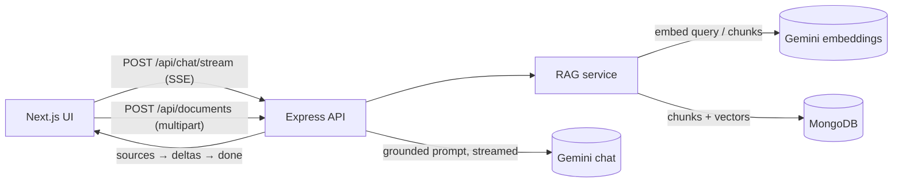

# AskShamir — grounded AI assistant with citations

A full-stack **retrieval-augmented generation (RAG)** chat app. Ask questions about Shahmir's CV, or upload your own documents (PDF / TXT / MD) and get answers that **stream token-by-token and cite the exact passages they came from**.

**Stack:** Next.js 15 (App Router) · React 19 · TypeScript · Tailwind 4 · Express 5 · MongoDB · Google Gemini (chat + embeddings) · Server-Sent Events · JWT auth

Live: https://shahmir-bot.vercel.app

## What it does

- **Grounded answers with citations.** Every reply is built from retrieved passages. Citations appear as `[1]`, `[2]` in the text and as clickable chips that expand to the source excerpt and its match score.
- **Bring your own documents.** Upload a PDF, TXT or Markdown file; it is chunked, embedded and searchable within seconds. Documents are private to the uploader; the CV is shared.
- **Real-time streaming** over Server-Sent Events, with a Stop button that halts the stream; the partial answer is still saved.
- **Resilient model calls.** Retry with exponential backoff, then automatic fallback across Gemini models when one is overloaded.
- **Auth & hardening.** bcrypt + JWT, schema validation (zod), per-IP and per-user rate limits, Helmet headers, CORS allow-list, upload size/type limits.

## Architecture



### How a question is answered

1. **Retrieve.** The question is embedded (`RETRIEVAL_QUERY`) and compared by cosine similarity against the shared CV chunks and the user's own chunks. Short follow-ups ("and before that?") are prefixed with the previous question so retrieval stays on topic.
2. **Filter.** Only the top 5 chunks scoring above a threshold are kept. The default `0.55` was calibrated against real `gemini-embedding-001` scores: relevant questions scored 0.59–0.73, unrelated ones 0.45–0.51. Irrelevant questions therefore get *no* context instead of misleading context.
3. **Ground.** Chunks are numbered in the prompt, and the system prompt instructs the model to cite them and to say so when the answer isn't in the excerpts.
4. **Stream.** The server sends a `sources` event first (so citations render immediately), then `delta` events, then `done`.
5. **Persist.** The exchange and its sources are saved, so history reloads with citations intact.

### Ingestion

`upload → extract text (pdf-parse / utf-8) → chunk (≈900 chars, 150 overlap, paragraph/sentence-aware) → batch-embed (768-dim) → store`. The shared CV is indexed lazily on first use with a content hash, so editing the PDF re-indexes automatically. A unique partial index makes first-time indexing race-safe across serverless instances.

## Design decisions & trade-offs

| Decision | Why | Trade-off |
|---|---|---|
| In-process cosine search over chunks loaded from MongoDB | Zero extra infrastructure; fast for the corpus sizes here (hundreds of chunks) | Doesn't scale to large corpora — the next step is Atlas Vector Search or pgvector behind the same `retrieve()` function |
| Replaced "paste the whole CV when the name is mentioned" with retrieval | Smaller prompts, works for any uploaded document, no brittle name matching | One extra embedding call per question |
| Retrieval failure degrades to a plain answer | Chat keeps working if embeddings are down | Answer is ungrounded for that turn |
| History capped to the last 20 messages | Bounds prompt size and cost | Very old context is forgotten |
| Model fallback only when *opening* the stream | Switching mid-stream would duplicate output | A mid-stream failure is surfaced, not hidden |
| Node's built-in test runner on the backend | No framework dependency | Fewer conveniences than Vitest/Jest |

## API

All routes except `/api/auth/*` and `/api/health` require `Authorization: Bearer <jwt>`.

| Method | Route | Description |
|---|---|---|
| POST | `/api/auth/register` | Create an account (email + password ≥ 8 chars) |
| POST | `/api/auth/login` | Returns a 1-hour JWT |
| GET | `/api/chat/history` | Messages, including stored `sources` |
| POST | `/api/chat/stream` | SSE: `{sources}` → `{delta}`… → `{done}` (or `{error}`) |
| POST | `/api/chat` | Non-streaming variant |
| GET | `/api/documents` | Shared CV + the user's uploads |
| POST | `/api/documents` | Upload a PDF/TXT/MD (≤ 5 MB, ≤ 10 per user) |
| DELETE | `/api/documents/:id` | Delete one of your uploads |
| GET | `/api/health` | DB / model / config status |

## Run it locally

Prerequisites: Node 22+, a MongoDB URI (Atlas free tier works), and a [Google AI API key](https://aistudio.google.com/apikey).

```bash
# backend
cd backend
cp .env.example .env      # fill in MONGO_URI, JWT_SECRET, GOOGLE_API_KEY
npm install
npm run dev               # http://localhost:5000

# frontend (new terminal)
cd frontend
npm install
echo NEXT_PUBLIC_API_BASE_URL=http://localhost:5000 > .env
npm run dev -- -p 3001    # http://localhost:3001
```

Backend environment variables:

| Variable | Default | Purpose |
|---|---|---|
| `MONGO_URI` | — | MongoDB connection string |
| `JWT_SECRET` | — | Signing secret for tokens |
| `GOOGLE_API_KEY` | — | Gemini API key |
| `MODEL_NAME` | `gemini-2.5-flash` | Primary chat model (fallbacks are built in) |
| `EMBEDDING_MODEL` | `gemini-embedding-001` | Embedding model (768 dims) |
| `RAG_TOP_K` / `RAG_MIN_SCORE` | `5` / `0.55` | Retrieval size and similarity cut-off |
| `FRONTEND_URL`, `CORS_ORIGINS` | — | Allowed browser origins |

## Tests

```bash
cd backend  && npm test     # 48 tests: chunker, vector math, prompt building, retry/fallback,
                            # auth, chat (RAG + SSE), document upload
cd frontend && npm test     # SSE parser incl. events split across network chunks
```

Backend route tests run the real Express app, validation, rate limiting and RAG pipeline, faking only the external boundaries (Gemini and MongoDB). CI (`.github/workflows/ci.yml`) runs tests, lint, type-check and a production build on every push and PR.

## Possible next steps

- Swap in-process search for a managed vector index (Atlas Vector Search) and add hybrid keyword + vector retrieval.
- Multiple conversations per user, plus a retrieval-quality eval set with recall@k tracked in CI.
- Move the backend to TypeScript.
